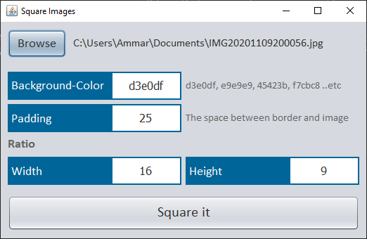

# SquareIt-GUI

[SquareIt](https://github.com/AmmarYasserAllaiThy/SquareIt)

Image squaring tool against a changeable pre-defined aspect-ratio `16 : 9` with extra options like *padding* and *background-color*.

